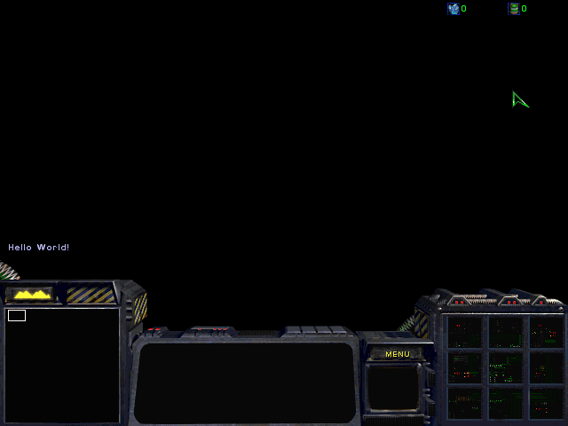

기초 2강. 첫번째 eudplib 프로그램, Hello, World!
================================================

.. note::
    The C Programming Language 라는 고전 C언어 책에서 첫번째 예제 프로그램을
    Hello World 띄우는걸로 했는데 그 이후 어떤 프로그래밍 책이던지 첫번째
    프로그램은 Hello World 띄우는걸로 하는게 전통이 됬어요.

eudplib를 깔아봤는데 일단 한번 써봐야죠. 화면에 Hello, World! 를 띄우는 맵을
만들어보겠습니다. 이 강좌를 통해서

- eudplib 코드를 저장하고 맵에 넣는 방법을 배웁니다.
- Current Player가 어떤 역할을 하는지 알아봅니다.
- f_getuserplayerid()를 이용해봅니다.

강좌를 읽다보시면 '뭐 이렇게 복잡하게 트리거를 짜야해!' 라는 말이 나오실지도
몰라요. 하지만 나중에 더 복잡한 eudplib 트리거를 짤때는 이런 예제처럼 트리거를
짜는게 훨씬 더 편하게 느껴지실겁니다. 지금은 그냥 입문이라 생각하시면 되요.

Hello World!
------------

eudplib 코드는 파이썬 코드입니다. 이 강좌에서 파이썬을 깊게 들어갈 생각은 없고,
그냥 eudplib를 쓰는데 무난한 정도로만 파이썬을 다룰겁니다.

1. 아래 코드를 메모장에 복사해서 example1.py라는 이름으로 적당한 폴더에
   저장하세요.

.. literalinclude:: examples/example11.py

2. 지형이나 트리거는 그냥 신경쓰지 말고 컴퓨터(P2) 하나 사람(P1)
   하나 있는 맵을 만들어서 example1.py랑 같은 폴더에 basemap.scx로 저장합니다.

   .. warning:: eudplib에는 scx 확장자로 된 맵만 넣을 수 있습니다. 맵을 .scx
       확장자로 저장하세요.

3. example1.py를 윈도우 탐색기에서 더블클릭하면 적당히 창이 뜨면서 ex1out.scx가
   생깁니다.

   .. image:: ar2_p1.png
       :name: example1.py 실행과정

   .. image:: ar2_p2.png
       :name: example1.py 실행 이후 폴더 내용. 파일 크기는 다를 수 있습니다.

.. warning:: 만약 이렇게 하는 도중에 문제가 생긴다면 스타 에디터 카페 (
    http://cafe.naver.com/edac ) 으로 질문 올려주세요.

이제 ex1out.scx를 스타에서 돌리면 이렇게 Hello World! 라고 뜰겁니다.

.. note::
    문제해결

    1. Hello, World! 가 안 뜬다면 **사람 플레이어가 P1이 맞는지** 확인해주세요.
       Randomize Start Location도 해제해두는게 좋습니다. 님이 무조건 P1이
       되야 합니다.

    2. 맵 실행이 안된다면 basemap.scx는 스타로 실행이 되는지 확인해주세요.
       만약 안된다면 Start location이나 플레이어나 세력 설정 등 체크...

.. warning:: 강좌대로 따라하다가 언제든지 문제가 생긴다면 스타 에디터 카페 (
    http://cafe.naver.com/edac ) 으로 질문 올려주세요.

좋아요. 첫번쨰 eudplib 맵을 만들었습니다.

코드의 의미
-----------

eudplib에서는 트리거와 관련 데이터만 넣을 수 있습니다. 그래서 트리거를 뺀 맵을
SCMDraft2같은 에디터로 미리 만들어둬야 하는데, 이것을 basemap이라고 합니다.
eudplib 맵은 이렇게 만듭니다.

1. basemap을 불러오고 ( :code:`LoadMap('basemap.scx')` )
2. 적당히 트리거를 만든 뒤, ( :code:`def main():` 과 들여쓰기된 부분 전체 )
3. basemap에 트리거를 넣어 맵을 저장합니다.  ( :code:`SaveMap('out.scx', main)`)

Hello, World! 예제 코드의 전반적인 의미를 주석을 곁들여 설명하면 이렇습니다.

.. literalinclude:: examples/example11_commented.py

SetCurrentPlayer
----------------

eudplib에서 Hello World를 띄우는데 성공했네요. 하지만 이 맵엔 약간 문제가
있습니다. basemap에서 P1, P2, P3, ... ,P7에 사람 플레이어를 넣고 P8에 컴퓨터
플레이어를 넣어서 맵을 만들어보면 P1 외에 다른 플레이어에서는
(P2, P3, .. , P7) Hello World가 안뜹니다. 이 문제점을 해결하기 위해서는
Current Player가 뭔지 이해해야해요.

문제점의 원인은 P1의 Display Text는 P2~P8가 무시한다는겁니다. 보통 맵 트리거를
만들 때 Player 1 트리거의 Display Text가 다른 플레이어에게 표시되진 않잖아요.
마찬가지 원리에요. **이 때 이 트리거가 Player 1의 트리거라는것을 표시하는게
Current Player입니다.** Current Player를 P2로 하면 P2에게만 Hello World가
뜨겠지요.

.. literalinclude:: examples/example11_p2.py

:code:`SetCurrentPlayer(P2)` 를 통해서 Current Player를 P2로 설정합니다. 이러면
P2에게만 Hello World가 뜰겁니다. Player 2가 Display Text 트리거를 실행했다고
보시면 됩니다.

P1 ~ P8의 모든 플레이어에게 Hello World를 띄우려면 각 플레이어가 각각
DisplayText를 한번씩 실행하도록 하면 됩니다. 즉, 각각의 플레이어로 Current
Player를 설정한 뒤에 각각 DisplayText를 한번씩 해주면 모든 플레이어에게
Hello World가 나오겠죠. 이렇게요.

.. literalinclude:: examples/example11_allp1.py

그런데 완성된 트리거를 보고나니까 뭔가 너무 액션 낭비인것같습니다. Hello World
하나 띄우려고 이렇게 액션 16개나 쓸 필요는 없을것같아요. 더 좋은 방법이
필요할 것 같습니다.

내가 몇플레이어인가?
--------------------

공방에서 뮤탈블러드를 한다고 해봅시다. 당신은 빨강색 Player 1입니다. 이 때
Player 1을 User Player라고 합니다. 쉽게 말해서 '내 플레이어' 라고 생각하시면
됩니다. Current Player랑은 확실히 구분되죠?

- User Player : 내가 무슨 플레이어인가
- Current Player : (트리거 실행중에) 지금 누구 트리거를 실행하고 있는가

사실 Display Text Message는 비공유 액션이잖아요? P2~P8이 DisplayText하는건 사실
별 관심 없고 P1이면 P1 DisplayText만 신경쓰면 될것같아요. ::

    # 내가 1플레이어면 이것만 실행하면 되겠다
    SetCurrentPlayer(P1),
    DisplayText('Hello World!'),

과정을 요약하자면

- 내가 몇플레어인지 알아낸다 : f_getuserplayerid로 얻어낼 수 있다.
- 그 플레이어로 SetCurrentPlayer
- DisplayText

입니다. 이런 과정으로 코드를 만들면 이렇게 됩니다.

.. literalinclude:: examples/example11_allp2.py

:code:`userpl = f_getuserplayerid()` 을 통해서 내가 몇 플레이어인지를 알아내고,
이것을 SetCurrentPlayer에 이용하는거죠.

간략한 코드 2
-------------

사실 이렇게 트리거가 단순할때는 f_getuserplayerid를 쓰는것보다
SetCurrentPlayer랑 Display Text를 8개씩 일일이 하는게 트리거 갯수가 적습니다.
:code:`userpl = f_getuserplayerid()` 안에 들어간
트리거 갯수가 꽤 되거든요. 하지만 비슷한 액션이 16개나 들어있는 트리거를 맵
전체에서 몇백개 써야한다면 짜증날거에요. 대신 이렇게 코드를 쓰셔도 됩니다. ::

    [
        [
            SetCurrentPlayer(player),
            DisplayText('Hello World!'),
        ] for player in range(8)  # player를 0~7 (P1~P8)
    ]

파이썬 문법중 하나인데, 저렇게 쓰면 range(8) (0 ~ 8-1 = 7) 의 각 player에 대해
:code:`[ SetCurrentPlayer(player), DisplayText('Hello World!') ]` 를 한번씩
복사하게 됩니다. 즉 이렇게 되는거죠. ::

    # eudplib 코드에서 [[a, b], [c, d]]는 [a, b, c, d]랑 같다.
    # 즉, for가 붙어있는게 아니라면 [] 안의 [랑 ]는 무시해도 된다.
    [
        [ SetCurrentPlayer(0), DisplayText('Hello World!'), ],
        [ SetCurrentPlayer(1), DisplayText('Hello World!'), ],
        [ SetCurrentPlayer(2), DisplayText('Hello World!'), ],
        [ SetCurrentPlayer(3), DisplayText('Hello World!'), ],
        [ SetCurrentPlayer(4), DisplayText('Hello World!'), ],
        [ SetCurrentPlayer(5), DisplayText('Hello World!'), ],
        [ SetCurrentPlayer(6), DisplayText('Hello World!'), ],
        [ SetCurrentPlayer(7), DisplayText('Hello World!'), ],
    ]

P1~P8이 0~7이랑 같다는것만 이해하시면 이게 원래 코드랑 같다는것도 쉽게 이해하실
수 있겠죠? 그냥 for문으로 노가다를 줄인것 뿐이에요. 최종 코드는 이렇습니다.

.. literalinclude:: examples/example11_allp3.py

.. note:: 잡팁이긴 한데, eudplib에는 조건 16개 제한이나 액션 64개 제한이
    없습니다. 둘 다 마음대로 쓰셔도 되요.

.. note::
    :code:`for player in range(8)` 를 요약하자면 이렇습니다. ::

        [
            (player에 대한 무언가)
            for player in range(8)
        ]

    예제에서는 :code:`(player에 대한 무언가)` 에 그냥
    :code:`[ SetCurrentPlayer(player), DisplayText('Hello World!'), ]` 를
    넣은거고요.
