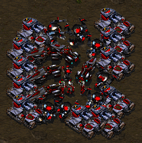
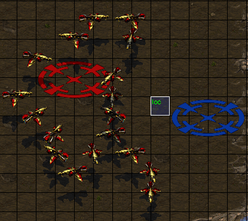
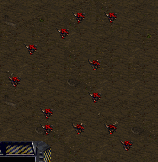

기초 5강. 반복문
=============================

EUDJump, EUDIf, EUDJumpIf 같은건 좀 할만해지셨나요. 이번 강좌에서는 반복문을
배워볼겁니다. 아마 맵을 만들면서 똑같은 트리거를 몇백개씩 복사해본 경험이
있으실거에요. (터보트리거 제외) 아니면 루퍼나 엑셀같은걸 써서 숫자 몇개만 다른
트리거를 엄청나게 만들어보셨을수도 있어요. 비슷한 트리거를 원하는만큼
여러번 실행시키려 할 때 쓰는게 반복문입니다. 이번 강좌에서는

- EUDJumpIf, EUDJumpIfNot 을 이용해서 반복문을 만들어보겠습니다.
- EUDLoopN, EUDWhile, EUDInfLoop같은걸 이용해서 반복문을 만들어봅니다.
- continue, break 개념을 배워봅니다.

첫번째 반복문
-------------

반복문이라는게 별게 아니라, 트리거나 코드를 여러번 실행시키는걸 반복문이라고
해요. 간단하게 예시를 들어보죠.

.. literalinclude:: examples/example44.py

실행결과는 이렇습니다.

- 마린이 1개
- 고스트가 3개
- 벌쳐가 5개
- 골리앗이 7개
- 탱크가 11개

만들어졌습니다. 표로 트리거가 어떤 순서로 실행됬는지 알아보면서 진행해봅시다

======  ===================  ===========================================
v의 값         코드                         해설
------  -------------------  -------------------------------------------
 0->0         v << 0

  --            --                      **첫번째 반복**
  0      ls = NextTrigger()             반복문 시작
  0         CreateUnit          0번유닛(마린) 2v+1 (1) 개 생성
 0->1         v += 1                    v에 1을 더한다.
  1        EUDJumpIfNot           v == 6가 거짓이므로 ls로 점프

  --            --                      **두번째 반복**
  1      ls = NextTrigger()             반복문 시작
  1         CreateUnit          1번유닛(고스트) 2v+1 (3) 개 생성
 1->2         v += 1                    v에 1을 더한다.
  2        EUDJumpIfNot           v == 6가 거짓이므로 ls로 점프

  --            --                      **세번째 반복**
  2      ls = NextTrigger()             반복문 시작
  2         CreateUnit          2번유닛(벌쳐) 2v+1 (5) 개 생성
 2->3         v += 1                    v에 1을 더한다.
  3        EUDJumpIfNot           v == 6가 거짓이므로 ls로 점프

  --            --                      **네번째 반복**
  3      ls = NextTrigger()             반복문 시작
  3         CreateUnit          3번유닛(골리앗) 2v+1 (7) 개 생성
 3->4         v += 1                    v에 1을 더한다.
  4        EUDJumpIfNot           v == 6가 거짓이므로 ls로 점프

  --            --                      **다섯번째 반복**
  4      ls = NextTrigger()             반복문 시작
  4         CreateUnit          4번유닛(골럇터렛) 2v+1 (9) 개 생성
 4->5         v += 1                    v에 1을 더한다.
  5        EUDJumpIfNot           v == 6가 참이므로 ls로 점프

  --            --                      **여섯번째 반복**
  5      ls = NextTrigger()             반복문 시작
  5         CreateUnit          5번유닛(시즈탱크) 2v+1 (11) 개 생성
 5->6         v += 1                    v에 1을 더한다.
  6        EUDJumpIfNot           v == 6가 참이므로 **점프 안함**

  5           main 끝
======  ===================  ===========================================

.. note::
    골리앗 터렛은 Create Unit으로 만들 수 없는 유닛이기 때문에
    :code:`CreateUnit(9, 5, "Anywhere", P1)` 의 효과가 안나타나는거지
    CreateUnit 액션 자체는 실행된겁니다.

EUDLoopN
--------

m이란 수에 대해서, EUDLoopN(m) ~ EUDEndLoopN 사이 내용물은 m번 반복됩니다.
예를 들어서 이렇게 하면

.. literalinclude:: examples/example41.py

결과가 이렇습니다. ::

    Before
    EUDLoopN
    EUDLoopN
    EUDLoopN
    EUDLoopN
    EUDLoopN
    After

.. note::
    :code:`if EUDLoopN(5):` 에서 if는 사실 별 의미가 없습니다. 파이썬에서
    들여쓰기하려면 if든지 뭐든지 필요해서 그냥 if를 써서 들여쓰기를 한거에요.
    파이썬에서 if의 실제 의미랑은 상관없습니다. 그렇다고 막
    :code:`while EUDLoopN(5):` 같이 이상한거 쓰시면 안됩니다. :code:`if` 만
    쓸 수 있어요.

트리거 실행 순서는 기본적으로 위에서 아래입니다. 그래서 위 코드를 해석하자면 ::

    DoActions(DisplayText('Before'))  # (1) 1번째로 실행

    # (2) EUDLoopN ~ EUDEndLoopN이 2번째로 실행
    if EUDLoopN(5):  # 5번 실행하라고 했으니까
        # 안의 내용이 5번 실행된다.
        DoActions(DisplayText('EUDLoopN'))
    EUDEndLoopN()

    # (3) 이게 3번째로 실행
    DoActions(DisplayText('After'))

처럼 되기 때문에 결과가 저렇게 뜨는겁니다.

.. note::
    C언어 코드랑 비교해보세요. ::

        int i;
        printf("Before\n");
        for(i = 0 ; i < 5 ; i++)
        {
            printf("EUDLoopN\n");
        }
        printf("After\n");

    C언어를 잘 몰라도 괜찮습니다.

EUDWhile
--------

EUDWhile은 '어떤 조건이 성립하는동안 계속 반복' 이란 뜻입니다. EUDWhile을
이용해서 맵에 있는 스카웃 배치대로 저글링을 만들어봅시다.

basemap에는 스카웃 여러개과 loc라는 로케이션을 깔아두었습니다.

이 스카웃 배치를 따라서 저글링을 만드려면 간단한 트릭을 응용하면 됩니다. 다른
분들은 '유닛 바꿔치기'라고 흔히들 하더군요. ::

    스카웃이 존재하면:
        1. 로케이션 loc를 스카웃중 하나 위로 옮겨서
        2, loc에 있는 스카웃을 지우고
        3. loc에 저글링 생성

를 스카웃 갯수만큼 복사하면 모든 스카웃이 한번에 저글링으로 바뀝니다. 맵만들때
흔히 쓰는 트리거에요. 우리는 eudplip를 쓰니까 트리거를 스카웃 갯수만큼 복사할
필요가 없습니다. 그냥 EUDWhile 쓰면 되요.

.. literalinclude:: examples/example42.py

결과는 이렇습니다. 깔끔하죠?

EUDWhile과 EUDVariable을 엮어 쓰는 경우도 많습니다. 맨 처음 EUDJumpIf로 만든
반복문 예제를 EUDWhile로 만들면 이렇게 됩니다.

.. literalinclude:: examples/example44_eudw.py

맨 처음 :code:`v << 0` 하고 나서 바로 :code:`v == 6` 을 체크한다는 점이
EUDJumpIf 버젼과는 약간 다릅니다만 나머지는 비슷비슷합니다.

EUDInfLoop
----------

:code:`EUDInfLoop`는 :code:`EUDWhile(Always())` 랑 똑같아요. 무한반복.
EUDBreak나 EUDContinue랑 엮여서 은근 자주 쓰이니까 EUDInfLoop가 어떤 의미인진
알아두시기 바랍니다.

EUDBreak, EUDContinue
---------------------

간단하게 EUDBreak랑 EUDContinue를 정리하자면 이렇습니다.

- EUDBreak : 반복문 밖으로 빠져나오는것
- EUDContinue : 반복문을 다시 도는것

.. code-block:: none

    반복문 밖

    if EUDInfLoop():
        A <------------+ <---------------------------+
                       |                             |
        ~~             | 반복문 시작점으로 EUDJump   |
                       |                             |
        EUDContinue() >+                             |
                                                     |
        if EUDIf( ~ ):                               |
            EUDContinue() >--------------------------+

            # EUDIf는 반복문이 아니므로 EUDContinue, EUDBreak는
            # 바로 밖에 있는 EUDInfLoop를 기준으로 돌아간다.

            EUDBreak() >------------------------------------+
        EUDEndIf()                                          |
                                                            |
        ~                                                   |
                                                            |
        EUDBreak() >---+                                    |
                       |                                    |
        ~              | 반복문 밖 다음 문장으로 EUDJump    |
                       |                                    |
    EUDEndInfLoop()    |                                    |
    B <----------------+ <----------------------------------+

EUDJumpIf과 비슷하게 EUDContinueIf(Not), EUDBreakIf(Not) 같은것도 있어요.
그리고 코드 짤 떄 편의를 위해서 EUDSetContinuePoint같은것도 있어요.

::
    v = EUDVariable()
    v << 0

    # v를 0 ~ 9 중에서 3의 배수를 제외한 숫자들로 돌린다.

    if EUDWhile(v < 10):

        EUDContinueIf(v % 3 == 0)  # v가 3의 배수면 무시

        # 적당한 코드

        # EUDWhile에 대한 Continue Point를 여기다가 설정
        EUDSetContinuePoint()  # EUDContinue류는 이제 여기로 점프한다.
        # EUDContinue를 해도 v += 1가 잘 실행됨.
        v += 1

    EUDEndWhile()

위의 코드에서 EUDSetContinuePoint가 없으면 v = 0일 때 계속 v < 10, v % 3 == 0
조건만 계속 비교하면서 v += 1이 실행이 안돼 무한루프가 걸립니다.
EUDSetContinuePoint는 C언어 for문같은걸 EUDWhile로 짤 때 유용하게 쓸 수
있을겁니다.

.. note::
    무한루프 : 영원히 반복하는 반복문. EUDDoEvents같은거 없이 이게 걸리면
    스타가 멈춥니다. EUDDoEvents는 다음 강좌에서 배울꺼에요.

연습문제
--------

없습니다.

.. note::
    어려우신가요? 원래 반복문과 조건문 개념이 조금 어려운 편에 속합니다.
    그래도 이해 못할 정도로 어려운건 아니니까 강좌를 보면서 차차 이해해가시면
    되요.

